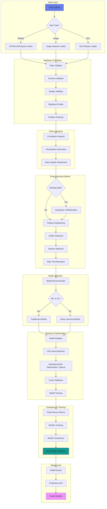
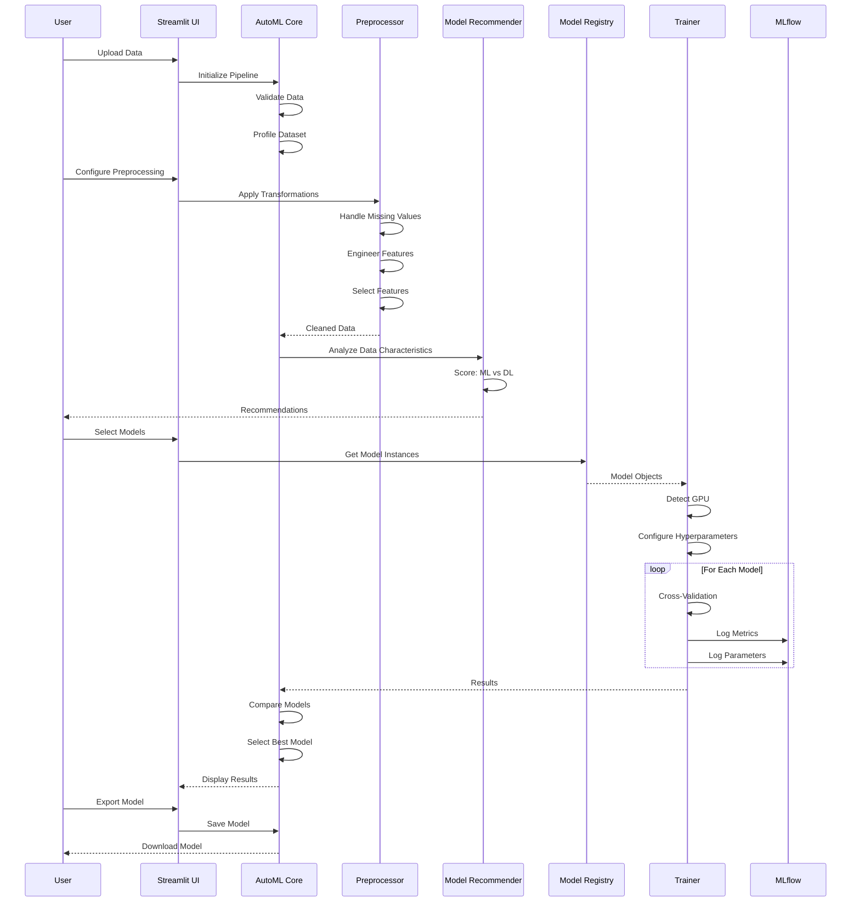
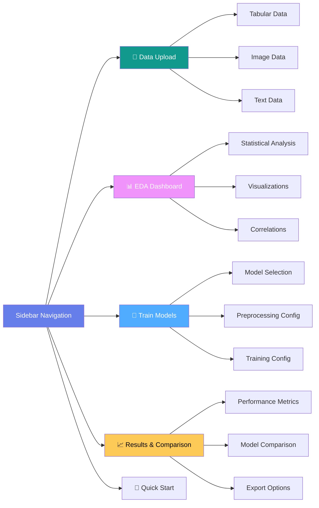

# 🤖 AutoML - Advanced Automated Machine Learning System

<div align="center">
  
</div>


> A comprehensive, production-ready automated machine learning system with **27+ ML/DL models**, **GPU acceleration**, and **intelligent model recommendations** for tabular, image, and text data.

## 📋 Table of Contents

- [Overview](#-overview)
- [Key Features](#-key-features)
- [Architecture](#-architecture)
- [Project Structure](#-project-structure)
- [How It Works](#-how-it-works)
- [Installation](#-installation)
- [Quick Start](#-quick-start)
- [Detailed Usage Guide](#-detailed-usage-guide)
- [File Documentation](#-file-documentation)
- [Examples](#-examples)
- [Configuration](#-configuration)
- [Performance & Optimization](#-performance--optimization)
- [Contributing](#-contributing)
- [License](#-license)

---

## 🌟 Overview

AutoML is an enterprise-grade automated machine learning pipeline designed to simplify the entire ML workflow—from data preprocessing to model deployment. It intelligently analyzes your data, recommends optimal models, and trains them with GPU acceleration for maximum performance.

### What Makes This AutoML Special?

- ✅ **Truly Multi-Modal**: Supports tabular, image, and text data with specialized models for each
- ✅ **GPU-First Design**: Automatic GPU acceleration for XGBoost, LightGBM, CatBoost, and all PyTorch models
- ✅ **Smart Recommendations**: AI-driven model selection with text column detection and auto-updating
- ✅ **Production Ready**: Type-safe code, comprehensive testing (317 tests), error handling
- ✅ **No Vendor Lock-in**: Open-source, runs locally, full control over your data and models

### 🆕 Recent Improvements (February 2026)

**Enhanced Recommendation System:**
- ✨ **Smart Text Detection**: Automatically detects text columns in tabular data
  - Distinguishes between metadata (Name, ID) and actual text data (reviews, messages)
  - Requires both long text (>50 chars) AND high cardinality (>50% unique) for strong signal
  - Text columns must be >30% of features to recommend Deep Learning
- ✨ **Auto-Updating Recommendations**: No refresh needed when uploading new data
  - Uploading new data automatically clears previous uploads
  - Recommendation updates instantly based on current dataset
  - Prevents stale recommendations from previous data
- ✨ **Improved Scoring Logic**: Better balance for medium-sized datasets with text
  - No penalty for text data in 1K-10K sample range
  - SMS spam detection, review analysis work better now
- ✨ **Fixed MLflow Logging**: Handles non-scalar metrics without errors
  - Arrays, dictionaries, and nested structures properly filtered
  - No more "ambiguous truth value" errors

**Real-World Impact:**
- 📧 **SMS Spam Dataset** (5,571 messages): Now correctly recommends DL (was ML)
- 🚢 **Titanic Dataset** (891 rows, Name column): Still recommends ML (was incorrectly DL)
- 📝 **Text Reviews**: Properly detects and recommends NLP models
- 📊 **Standard Tabular**: Continues to recommend efficient ML models

---

## 🎯 Key Features

### Core Capabilities

| Feature | Description |
|---------|-------------|
| **🎨 Multi-Modal Support** | Tabular (CSV/Excel/Parquet), Image (JPG/PNG), Text (NLP) |
| **⚡ GPU Acceleration** | Auto-detection and optimization for CUDA-enabled GPUs |
| **🧠 Smart Model Selection** | AI recommends ML vs DL based on data type, text detection, size, complexity |
| **🔧 Advanced Preprocessing** | KNN/Iterative imputation, outlier detection, feature engineering |
| **📊 27+ Models** | 18 traditional ML + 9+ deep learning architectures |
| **🎯 Hyperparameter Tuning** | Bayesian optimization with Optuna |
| **📈 Experiment Tracking** | MLflow integration for reproducibility |
| **🖥️ Interactive UI** | Beautiful Streamlit web interface |
| **⌨️ CLI Support** | Command-line interface for automation |
| **💾 Model Export** | Save/load models in multiple formats |

### Supported Models

#### Traditional ML (18 Models)
**Boosting** (GPU-accelerated):
- XGBoost, LightGBM, CatBoost
- GradientBoosting, AdaBoost

**Trees & Ensembles**:
- RandomForest, ExtraTrees, DecisionTree

**Linear Models**:
- LogisticRegression, LinearRegression
- Ridge, Lasso, ElasticNet

**Other**:
- SVM (SVC/SVR)
- KNN (KNeighbors)
- GaussianNB

#### Deep Learning (9+ Models)
**Tabular Data**:
- MLP (Multi-Layer Perceptron)
- TabularResNet (Residual Network)
- TabularAttention (Self-Attention)
- Wide & Deep Network

**Computer Vision**:
- SimpleCNN, MediumCNN
- ResNet (18, 50)
- VGG (16, 19)
- DenseNet (121, 169)
- EfficientNet-B0

**NLP/Text**:
- LSTM, GRU
- TextCNN
- Attention-based models

---

## 🏗️ Architecture

### System Architecture Diagram



### Component Interaction Flow



---

## 📁 Project Structure

```
AutoML/
├── 📄 Core Application Files
│   ├── app.py                      # Streamlit web interface (6000+ lines)
│   ├── automl_cli.py               # Command-line interface
│   ├── config.yaml                 # Configuration file
│   ├── pyproject.toml              # Project metadata & dependencies
│   ├── setup.py                    # Package installation script
│   └── requirements*.txt           # Dependency specifications
│
├── 📦 automl/                      # Main Python package
│   ├── __init__.py                 # Package initialization
│   │
│   ├── 🧠 core/                    # Core AutoML logic
│   │   ├── automl.py               # Main AutoML class (orchestrator)
│   │   └── __init__.py
│   │
│   ├── ⚙️ config/                  # Configuration management
│   │   ├── config.py               # Config loader & validator
│   │   ├── default_config.yaml     # Default settings
│   │   └── __init__.py
│   │
│   ├── 📊 data/                    # Data handling
│   │   ├── loaders.py              # CSV, Parquet, Excel loaders
│   │   ├── validators.py           # Data, schema, quality validation
│   │   ├── metadata.py             # Dataset metadata extraction
│   │   └── __init__.py
│   │
│   ├── 🔍 eda/                     # Exploratory Data Analysis
│   │   ├── statistical_profiler.py # Statistical analysis
│   │   ├── problem_detector.py     # Auto-detect ML problem type
│   │   ├── correlation_analyzer.py # Feature correlations
│   │   ├── visualization.py        # Chart generation
│   │   └── __init__.py
│   │
│   ├── 🎯 models/                  # All ML/DL models
│   │   ├── base_model.py           # Abstract base model class
│   │   ├── registry.py             # Model registration & retrieval
│   │   ├── recommender.py          # ML vs DL recommendation engine
│   │   ├── model_metadata.py       # Model info & capabilities
│   │   │
│   │   ├── traditional/            # Scikit-learn models
│   │   │   ├── ensemble_models.py  # RF, XGBoost, LightGBM, CatBoost
│   │   │   ├── linear_models.py    # Regression, Ridge, Lasso, ElasticNet
│   │   │   ├── tree_models.py      # Decision Trees
│   │   │   ├── svm_models.py       # Support Vector Machines
│   │   │   ├── neighbor_models.py  # KNN
│   │   │   ├── naive_bayes_models.py # Naive Bayes
│   │   │   └── __init__.py
│   │   │
│   │   └── deep_learning/          # PyTorch models
│   │       ├── base_dl_model.py    # DL base class
│   │       ├── device_manager.py   # GPU/CPU management
│   │       ├── mlp_models.py       # Tabular: MLP
│   │       ├── advanced_tabular_models.py # ResNet, Attention, Wide&Deep
│   │       ├── tabular_dataset.py  # PyTorch dataset for tabular
│   │       │
│   │       ├── vision/             # Computer Vision
│   │       │   ├── cnn_models.py   # SimpleCNN, MediumCNN
│   │       │   ├── image_dataset.py # Image data loader
│   │       │   ├── transforms.py   # Data augmentation
│   │       │   └── __init__.py
│   │       │
│   │       └── nlp/                # Natural Language Processing
│   │           ├── text_models.py  # LSTM, GRU, TextCNN, Attention
│   │           ├── text_dataset.py # Text data loader
│   │           ├── embeddings.py   # Word embeddings
│   │           └── __init__.py
│   │
│   ├── 🔧 preprocessing/           # Data preprocessing
│   │   ├── pipeline_builder.py     # Preprocessing pipeline orchestrator
│   │   │
│   │   ├── cleaners/               # Data cleaning
│   │   │   ├── missing_handler.py  # Missing value imputation
│   │   │   ├── outlier_detector.py # Outlier detection & handling
│   │   │   └── __init__.py
│   │   │
│   │   ├── transformers/           # Data transformations
│   │   │   ├── encoders.py         # Categorical encoding
│   │   │   ├── scalers.py          # Numerical scaling
│   │   │   ├── normalizers.py      # Data normalization
│   │   │   └── __init__.py
│   │   │
│   │   ├── feature_engineering/    # Feature creation
│   │   │   ├── feature_creator.py  # Auto feature generation
│   │   │   ├── polynomial_features.py # Polynomial features
│   │   │   ├── interaction_features.py # Feature interactions
│   │   │   └── __init__.py
│   │   │
│   │   ├── feature_selection/      # Feature selection
│   │   │   ├── feature_selector.py # Multiple selection methods
│   │   │   ├── importance_based.py # Model-based importance
│   │   │   ├── correlation_based.py # Correlation filtering
│   │   │   └── __init__.py
│   │   │
│   │   └── splitters/              # Data splitting
│   │       ├── train_test_splitter.py # Train/test/validation split
│   │       ├── stratified_splitter.py # Stratified sampling
│   │       └── __init__.py
│   │
│   ├── 🎯 optimization/            # Hyperparameter optimization
│   │   ├── optuna_optimizer.py     # Optuna integration
│   │   ├── hyperparameter_spaces.py # Search spaces per model
│   │   └── __init__.py
│   │
│   ├── 🏃 training/                # Model training
│   │   ├── trainer.py              # Training orchestrator
│   │   ├── cross_validator.py      # K-Fold cross-validation
│   │   ├── early_stopping.py       # Early stopping for DL
│   │   └── __init__.py
│   │
│   ├── 📈 tracking/                # Experiment tracking
│   │   ├── mlflow_tracker.py       # MLflow integration
│   │   ├── metrics.py              # Performance metrics
│   │   └── __init__.py
│   │
│   ├── 🖥️ ui/                      # UI components (for app.py)
│   │   ├── components.py           # Reusable UI components
│   │   └── __init__.py
│   │
│   └── 🛠️ utils/                   # Utilities
│       ├── logger.py               # Logging configuration
│       ├── exceptions.py           # Custom exceptions
│       ├── validators.py           # Input validation
│       ├── file_handlers.py        # File I/O utilities
│       └── __init__.py
│
├── 📚 examples/                    # Usage examples
│   ├── quickstart.py               # Quick start example
│   ├── automl_example.py           # Full pipeline example
│   ├── preprocessing_example.py    # Preprocessing demo
│   ├── feature_engineering_example.py
│   ├── feature_selection_example.py
│   ├── outlier_detection_example.py
│   ├── advanced_imputation_example.py
│   ├── model_example.py            # Model training
│   ├── deep_learning_example.py    # DL tabular example
│   ├── computer_vision_example.py  # Image classification
│   ├── nlp_example.py              # Text classification
│   ├── mlflow_tracking_example.py  # Experiment tracking
│   ├── mlp_optimization_example.py # Hyperparameter tuning
│   └── training_example.py         # Advanced training
│
├── 🧪 tests/                       # Comprehensive test suite (317 tests)
│   ├── test_core.py                # Core functionality tests
│   ├── test_data.py                # Data handling tests
│   ├── test_eda.py                 # EDA tests
│   ├── test_models.py              # Model tests
│   ├── test_preprocessing.py       # Preprocessing tests
│   ├── test_optimization.py        # Optimization tests
│   ├── test_training.py            # Training tests
│   ├── test_tracking.py            # Tracking tests
│   ├── test_integration.py         # Integration tests
│   ├── test_vision.py              # Computer vision tests
│   └── test_nlp.py                 # NLP tests
│
├── 📊 data/                        # Sample datasets
│   ├── sample_loan_data.csv
│   ├── Titanic-Dataset.csv
│   ├── eda_example.csv
│   ├── advanced_example.csv
│   └── large_test_dataset.csv
│
├── 📖 docs/                        # Documentation
│   ├── getting_started.md          # Getting started guide
│   ├── CLI_AND_INTEGRATION.md      # CLI documentation
│   └── ...
│
├── 💾 saved_models/                # Exported models
├── 📊 mlruns/                      # MLflow experiment tracking
├── 📈 visualizations/              # Generated visualizations
├── 📁 outputs/                     # Output files
├── 📊 htmlcov/                     # Coverage reports
├── 🧾 results/                     # Results cache
│
└── 📄 Configuration & Metadata
    ├── LICENSE                     # MIT License
    ├── README.md                   # This file
    ├── CONTRIBUTING.md             # Contribution guidelines
    ├── QUICK_START_GUIDE.md        # Quick start
    └── coverage.xml                # Coverage data
```

---

## 🔄 How It Works

### Complete Pipeline Flow

```mermaid
flowchart TD
    Start([👤 User Starts]) --> Upload{Upload Method?}
    
    Upload -->|Web UI| UI[🖥️ Streamlit Interface]
    Upload -->|CLI| CLI[⌨️ Command Line]
    Upload -->|Code| API[🐍 Python API]
    
    UI --> DataLoad[📥 Load Data]
    CLI --> DataLoad
    API --> DataLoad
    
    DataLoad --> Validate{✅ Valid?}
    Validate -->|No| Error[❌ Show Errors]
    Validate -->|Yes| Profile[📊 Profile Data]
    
    Profile --> Stats[Calculate Statistics]
    Stats --> Detect[🔍 Detect Problem Type]
    Detect --> Analyze[📈 Correlation Analysis]
    Analyze --> Visualize[📉 Generate Visualizations]
    
    Visualize --> PreprocessQ{Preprocess?}
    PreprocessQ -->|No| ModelSelect
    PreprocessQ -->|Yes| Preprocess
    
    Preprocess --> Missing{Missing Data?}
    Missing -->|Yes| Impute[Fill: KNN/Iterative]
    Missing -->|No| Outliers
    Impute --> Outliers{Outliers?}
    Outliers -->|Yes| HandleOutliers[Detect & Handle]
    Outliers -->|No| Features
    HandleOutliers --> Features[🔧 Engineer Features]
    
    Features --> SelectFeatures[🎯 Select Features]
    SelectFeatures --> Transform[Transform Data]
    Transform --> Split[Split Train/Test]
    
    Split --> ModelSelect[🤖 Model Selection]
    ModelSelect --> Recommend{Auto-Recommend?}
    Recommend -->|Yes| Recommender[AI Analyzes Dataset]
    Recommend -->|No| ManualSelect[User Selects Models]
    
    Recommender --> Score[Calculate ML vs DL Score]
    Score --> Decision{Score Analysis}
    Decision -->|Score > 60| DLModels[🔷 Deep Learning]
    Decision -->|Score < 40| MLModels[🔶 Traditional ML]
    Decision -->|40-60| BothModels[🔶🔷 Try Both]
    
    ManualSelect --> GetModels
    DLModels --> GetModels[Get Model Instances]
    MLModels --> GetModels
    BothModels --> GetModels
    
    GetModels --> GPUCheck{GPU Available?}
    GPUCheck -->|Yes| EnableGPU[⚡ Enable GPU Acceleration]
    GPUCheck -->|No| CPUMode[💻 CPU Mode]
    
    EnableGPU --> Optimize
    CPUMode --> Optimize{Optimize Hyperparameters?}
    
    Optimize -->|Yes| Optuna[Optuna Bayesian Optimization]
    Optimize -->|No| DefaultParams[Use Default Parameters]
    
    Optuna --> HPSpace[Define Search Space]
    HPSpace --> HPSearch[Search Best Parameters]
    HPSearch --> Train
    DefaultParams --> Train
    
    Train[🏋️ Train Models]
    Train --> CV{Cross-Validation?}
    CV -->|Yes| KFold[K-Fold CV]
    CV -->|No| SingleTrain[Single Train/Test]
    
    KFold --> TrainLoop
    SingleTrain --> TrainLoop
    
    TrainLoop[Training Loop] --> TrackML[📊 MLflow Tracking]
    TrackML --> LogParams[Log Parameters]
    LogParams --> LogMetrics[Log Metrics]
    LogMetrics --> LogArtifacts[Log Artifacts]
    
    LogArtifacts --> MoreModels{More Models?}
    MoreModels -->|Yes| TrainLoop
    MoreModels -->|No| Evaluate
    
    Evaluate[📈 Evaluate Results] --> Compare[Compare Models]
    Compare --> Rank[Rank by Performance]
    Rank --> SelectBest[🏆 Select Best Model]
    
    SelectBest --> Display[📊 Display Results]
    Display --> Export{Export Model?}
    
    Export -->|Yes| SaveModel[💾 Save Model]
    Export -->|No| Predict{Make Predictions?}
    
    SaveModel --> Predict
    Predict -->|Yes| LoadTest[Load Test Data]
    Predict -->|No| End
    
    LoadTest --> Inference[🔮 Run Inference]
    Inference --> Results[Return Predictions]
    Results --> End([✅ Complete])
    
    style Start fill:#667eea,color:#fff
    style End fill:#11998e,color:#fff
    style Error fill:#f5576c,color:#fff
    style Recommender fill:#f093fb,color:#fff
    style Train fill:#4facfe,color:#fff
    style SelectBest fill:#feca57,color:#000
```



### Model Recommendation Algorithm

**Smart Detection System:**
- **Image/Text Data**: Automatically uses Deep Learning (100/100 score)
- **Tabular Data**: Intelligent analysis based on multiple factors
- **Text Column Detection**: Identifies high-cardinality text columns requiring NLP
- **Auto-Update**: Recommendation refreshes automatically on new data upload

**Text Detection Logic** (for tabular data):
```python
Strong Text Signals:
- Very long text: >100 chars average (documents, articles)
- OR both: >50 chars average AND >50% unique values (SMS, reviews)
- Text columns must be >30% of total features to recommend DL
- Otherwise: Minor text presence, adds +20 points only
```



```mermaid
graph LR
    A[Input: Dataset] --> B[Analyze Data Type]
    B --> C{Image/Text Upload?}
    C -->|Yes| D[DL Required: 100/100]
    C -->|No| E[Check Text Columns]
    
    E --> F{Strong Text?}
    F -->|Yes > 30%| G[Score +75]
    F -->|Minor < 30%| H[Score +20]
    F -->|No Text| I[Check Size]
    
    G --> J[Check Dataset Size]
    H --> I
    I --> K{Rows > 100k?}
    K -->|Yes| L[Score +30]
    K -->|No| M{Rows < 1k?}
    M -->|Yes| N[Score -30]
    M -->|No| O[Score ±10]
    
    J --> P{Has Text?}
    P -->|Yes| Q[No Penalty]
    P -->|No| L
    
    Q --> R[Check Features]
    L --> R
    N --> R
    O --> R
    
    R --> S{Features > 200?}
    S -->|Yes| T[Score +15]
    S -->|No| U{Features < 10?}
    U -->|Yes| V[Score -20]
    U -->|No| W[Score ±5]
    
    T --> X[Calculate Final Score]
    V --> X
    W --> X
    
    X --> Y{Score >= 60?}
    Y -->|Yes| Z[Recommend: Deep Learning]
    Y -->|No| AA{Score <= 40?}
    AA -->|Yes| AB[Recommend: Traditional ML]
    AA -->|No| AC[Recommend: Try Both]
    
    style D fill:#ff9f66,color:#fff
    style Z fill:#667eea,color:#fff
    style AB fill:#11998e,color:#fff
    style AC fill:#f093fb,color:#fff
```

### Data Processing Pipeline

```mermaid
graph LR
    A[Raw Data] --> B{Missing Values?}
    B -->|Yes| C[Imputation]
    B -->|No| D{Outliers?}
    C --> D
    
    D -->|Yes| E[Outlier Handling]
    D -->|No| F[Feature Engineering]
    E --> F
    
    F --> G[Polynomial Features]
    G --> H[Feature Interactions]
    H --> I[Feature Selection]
    
    I --> J{Classification?}
    J -->|Yes| K[Categorical Encoding]
    J -->|No| L[Numerical Scaling]
    K --> L
    
    L --> M[Train/Test Split]
    M --> N[Processed Data]
    
    style A fill:#667eea,color:#fff
    style N fill:#11998e,color:#fff
```



---

## 🚀 Installation

### Prerequisites

- **Python**: 3.10 or higher
- **Operating System**: Windows, Linux, or macOS
- **GPU** (Optional but recommended): CUDA-enabled NVIDIA GPU for acceleration
- **RAM**: Minimum 8GB (16GB+ recommended for large datasets)

### Option 1: Basic Installation (CPU Only)

```bash
# Clone the repository
git clone https://github.com/yourusername/AutoML.git
cd AutoML

# Create virtual environment
python -m venv venv

# Activate virtual environment
# On Windows:
venv\Scripts\activate
# On Linux/Mac:
source venv/bin/activate

# Install package
pip install -e .
```

### Option 2: Full Installation with GPU Support

```bash
# Clone and setup environment (same as above)
git clone https://github.com/yourusername/AutoML.git
cd AutoML
python -m venv venv
venv\Scripts\activate  # Windows

# Install PyTorch with CUDA support (adjust CUDA version as needed)
pip install torch torchvision torchaudio --index-url https://download.pytorch.org/whl/cu118

# Install package with all dependencies
pip install -e .

# Install additional deep learning dependencies
pip install -r requirements-dl.txt
```

### Option 3: Development Installation

```bash
# Clone repository
git clone https://github.com/yourusername/AutoML.git
cd AutoML

# Create environment
python -m venv venv
venv\Scripts\activate  # Windows

# Install with development dependencies
pip install -e ".[dev]"

# Or use requirements-dev.txt
pip install -r requirements-dev.txt

# Verify installation
pytest
```

### Verify GPU Installation

```python
import torch
print(f"CUDA Available: {torch.cuda.is_available()}")
print(f"CUDA Version: {torch.version.cuda}")
print(f"GPU Device: {torch.cuda.get_device_name(0) if torch.cuda.is_available() else 'None'}")
```

---

## ⚡ Quick Start

### Method 1: Web Interface (Recommended for Beginners)

```bash
# Start the Streamlit UI
streamlit run app.py
```

Then navigate to http://localhost:8501 in your browser.

**Features available in Web UI:**
- 📁 Drag-and-drop data upload
- 📊 Interactive EDA dashboards
- 🎯 Visual model selection
- ⚙️ Point-and-click preprocessing configuration
- 📈 Beautiful result visualizations
- 💾 One-click model export

### Method 2: Python API (Recommended for Automation)

```python
from automl.pipeline import AutoML
import pandas as pd

# 1. Initialize AutoML
automl = AutoML(
    problem_type='classification',  # or 'regression', or None for auto-detect
    use_cross_validation=True,
    cv_folds=5,
    verbose=True
)

# 2. Load and train
results = automl.fit(
    data='data/your_data.csv',
    target_column='target',
    models_to_try=['xgboost', 'random_forest', 'lightgbm']  # Auto GPU
)

# 3. View results
print(f"Best Model: {results['best_model']}")
print(f"Accuracy: {results['best_score']:.4f}")

# 4. Make predictions
predictions = automl.predict(test_data)
probabilities = automl.predict_proba(test_data)  # For classification

# 5. Save model
automl.save('models/my_best_model')

# 6. Load later
from automl.pipeline import AutoML
loaded_automl = AutoML.load('models/my_best_model')
new_predictions = loaded_automl.predict(new_data)
```

### Method 3: Command Line Interface

```bash
# Basic training
python automl_cli.py train data.csv target --models xgboost lightgbm

# With cross-validation
python automl_cli.py train data.csv target --cv --cv-folds 5

# With preprocessing
python automl_cli.py train data.csv target \
    --impute knn \
    --handle-outliers iqr \
    --feature-engineering \
    --feature-selection mutual_info

# Advanced options
python automl_cli.py train data.csv target \
    --models xgboost lightgbm catboost mlp \
    --cv --cv-folds 10 \
    --optimize \
    --trials 50 \
    --use-gpu \
    --output-dir results/experiment1/
```

---

## �️ Web Interface (UI) Guide

### Overview

The AutoML Streamlit web interface provides a complete, user-friendly environment for your machine learning workflow. Access all features through an intuitive, visually appealing interface with real-time feedback and interactive visualizations.

### Starting the Web Interface

```bash
streamlit run app.py
```

The interface will open automatically at `http://localhost:8501`

### UI Architecture



---

### Page 1: 📁 Data Upload

**Purpose**: Upload and preview your dataset

#### Features:

**1. Data Type Selection**
- Choose between **Tabular**, **Image**, or **Text** data
- Visual cards make selection intuitive
- System automatically configures based on your choice

**2. Tabular Data Upload**

**Supported Formats:**
- CSV files (`.csv`)
- Excel files (`.xlsx`, `.xls`)
- Parquet files (`.parquet`)

**How to Use:**
1. Click on **"📊 Tabular Data"** button
2. Use the file uploader or drag & drop your file
3. System automatically loads and validates data
4. Preview appears instantly with:
   - Row/column counts
   - Missing value percentage
   - Memory usage
   - Data type distribution

**Advanced Options (for large files):**
- ✅ **Limit Rows**: Load only first N rows for faster processing
- Configurable row limit (1K to 1M rows)
- Useful for datasets > 100K rows

**3. Image Data Upload**

**Three Upload Methods:**

**Method A: ZIP File Upload**
```
Structure:
dataset.zip
├── class1/
│   ├── image1.jpg
│   └── image2.jpg
└── class2/
    ├── image3.jpg
    └── image4.jpg
```
- Folder names become class labels
- Supports JPG, PNG, BMP formats
- Automatic class distribution analysis

**Method B: Local Folder**
- Click "Browse files" button
- Select folder containing class subfolders
- System scans and loads images automatically

**Method C: Individual Images**
- Upload images one by one
- Manually specify labels
- Best for small datasets

**4. Text Data Upload**

**CSV Upload:**
- Upload CSV with text and label columns
- Auto-detects text and label columns
- Smart recommendations based on:
  - Average text length
  - Unique value ratios
  - Column characteristics

**Text Column Detection:**
- System identifies columns with long strings
- Recommends conversion to NLP format if needed
- One-click conversion available

**Auto-Clear Previous Data:**
- Uploading new data automatically clears previous uploads
- Ensures recommendation system uses current data only
- No manual refresh needed - recommendations update instantly
- Behavior:
  - **Tabular upload** → clears text_data and image_data
  - **Text upload** → clears tabular data and image_data
  - **Image upload** → clears tabular data and text_data

**5. Data Preview Features**

Once data is loaded, you'll see:

**Metric Cards:**
- 📊 Total rows
- 📋 Total columns  
- ❌ Missing percentage
- 💾 Memory usage (MB)

**Visualizations:**
- **Data Type Distribution**: Pie chart showing numerical vs categorical
- **Feature Type Breakdown**: Bar chart of feature categories

**Interactive Data Table:**
- Pagination controls (10/25/50/100 rows per page)
- Page navigation
- Total pages counter
- Search and filter capabilities
- Scrollable view for wide datasets

**Column Information Table:**
- Column names
- Data types
- Non-null counts
- Null counts
- Unique value counts

**Export Options:**
- 📥 Download as CSV
- 📥 Download as Excel (with formatting)
- For large datasets: Generate on demand (prevents timeout)

**6. Sample Datasets**

Don't have data? Try built-in examples:
- 🎯 **Iris Dataset**: Classification (150 rows, 4 features)
- 📈 **California Housing**: Regression (20K rows, 8 features)
- One-click load directly into the system

---

### Page 2: 📊 EDA Dashboard

**Purpose**: Explore and understand your data through interactive visualizations

#### Tabular Data EDA

**Tab 1: Overview**

**Statistical Summary:**
- Mean, median, std deviation for numerical columns
- Count, unique values for categorical columns
- Quartile information (Q1, Q2, Q3)
- Min/max values

**Data Quality Metrics:**
- Missing value heatmap (visual representation)
- Percentage missing per column
- Data type distribution chart
- Correlation warnings for highly correlated features

**Tab 2: Distributions**

**Numerical Columns:**
- Interactive histograms with hover details
- Box plots showing outliers
- Density plots for distribution shape
- Automatically adapts to data skewness

**Categorical Columns:**
- Bar charts of value counts
- Pie charts for class distribution
- Top N categories visualization
- Frequency tables

**Performance Optimization:**
- For datasets > 100K rows: Uses 10K row sample
- Maintains accuracy while ensuring speed
- Sample notification displayed

**Tab 3: Correlations**

**Correlation Matrix:**
- Interactive heatmap
- Color-coded strength (-1 to +1)
- Click to see exact values
- Filterable by correlation strength

**Top Correlations:**
- List of strongest positive correlations
- List of strongest negative correlations
- Correlation values with target (if specified)
- Multicollinearity warnings

**Tab 4: Missing Data Analysis**

**Visualizations:**
- Missing data heatmap
- Percentage missing per column (bar chart)
- Missing data patterns
- Recommendations for imputation strategy

**Smart Recommendations:**
- Suggests KNN for <30% missing
- Suggests Iterative for >30% missing
- Warns if >70% missing (drop recommendation)

#### Image Data EDA

**Tab 1: Dataset Overview**
- Total images count
- Number of classes
- Average images per class
- Class distribution table with percentages

**Tab 2: Class Distribution**
- Interactive bar chart of images per class
- Pie chart showing class balance
- Imbalance warnings (if ratio > 3:1)
- Stratified sampling recommendations

**Tab 3: Sample Images**
- Grid view of random images from each class
- Image dimensions shown below each image
- Refresh button for new samples
- Adjustable grid size (3x3, 4x4, 5x5)

**Tab 4: Image Properties**

**Dimension Analysis:**
- Width/height statistics (min, max, mean, std)
- Dimension distribution histograms
- Aspect ratio analysis
- Size recommendation for training

**File Size Stats:**
- Total dataset size (GB)
- Average file size (KB)
- Size distribution
- Memory usage estimation for training

**Format Distribution:**
- JPG vs PNG vs other formats
- Color vs grayscale detection
- Channel information (RGB, RGBA, etc.)

#### Text Data EDA

**Tab 1: Class Overview**
- Number of unique classes
- Samples per class
- Class balance analysis
- Imbalance warnings and suggestions

**Tab 2: Text Length Analysis**

**Character Count:**
- Min, max, mean, std deviation
- Distribution histogram
- Outlier detection
- Truncation recommendations

**Word Count:**
- Words per document statistics
- Distribution visualization
- Vocabulary size estimation
- Sequence length recommendations

**Tab 3: Vocabulary Analysis**

**Top Words:**
- Most frequent words table
- Word frequency bar chart
- Stop word identification
- Word cloud visualization (if enabled)

**Vocabulary Stats:**
- Total unique words
- Average words per class
- Vocabulary growth curve
- Coverage analysis

**Tab 4: Sample Texts**
- Random text samples from each class
- Labeled examples
- Text length shown
- Refresh for new samples

**Performance Features:**
- For large text datasets (>10K): Uses sampling
- Maintains statistical accuracy
- Fast rendering with lazy loading

---

### Page 3: 🎯 Train Models

**Purpose**: Configure, train, and optimize machine learning models

#### Step 1: Model Selection

**Three Main Categories:**

**1. 🔷 Traditional ML Models**

**Available Models:**
- ✅ **XGBoost** (GPU-accelerated)
- ✅ **LightGBM** (GPU-accelerated)
- ✅ **CatBoost** (GPU-accelerated)
- ✅ **Random Forest**
- ✅ **Gradient Boosting**
- ✅ **Extra Trees**
- ✅ **Decision Tree**
- ✅ **Logistic/Linear Regression**
- ✅ **Ridge Regression**
- ✅ **Lasso Regression**
- ✅ **ElasticNet**
- ✅ **SVM (SVC/SVR)**
- ✅ **KNN**
- ✅ **Naive Bayes**

**Selection Options:**
- Multi-select checkboxes
- GPU badge shows if acceleration available
- Recommended models highlighted based on data
- "Select All" / "Clear All" buttons

**2. 🔶 Deep Learning - Tabular**

**Available Architectures:**
- ✅ **MLP (Multi-Layer Perceptron)**: Basic neural network
- ✅ **Tabular ResNet**: Residual connections for deep learning
- ✅ **Tabular Attention**: Self-attention mechanism
- ✅ **Wide & Deep**: Google's hybrid architecture

**Configuration per Model:**
- Hidden layer sizes
- Number of layers
- Dropout rates
- Activation functions
- Batch normalization options

**3. 🔷 Deep Learning - Vision**

**Available Architectures:**
- ✅ **SimpleCNN**: Lightweight custom CNN
- ✅ **MediumCNN**: Deeper custom CNN
- ✅ **ResNet18/50**: Deep residual networks
- ✅ **VGG16/19**: Visual Geometry Group networks
- ✅ **DenseNet121/169**: Dense connections
- ✅ **EfficientNet-B0**: Efficient scaling

**Transfer Learning Options:**
- Use pre-trained weights (ImageNet)
- Fine-tune all layers vs freeze early layers
- Custom final layer configuration

**4. 🔶 Deep Learning - NLP**

**Available Architectures:**
- ✅ **LSTM**: Long Short-Term Memory
- ✅ **GRU**: Gated Recurrent Unit
- ✅ **TextCNN**: Convolutional network for text
- ✅ **Attention**: Self-attention based classifier

**Configuration:**
- Embedding dimension (50-300)
- Hidden dimension (64-512)
- Number of layers (1-4)
- Bidirectional option (LSTM/GRU)
- Dropout rates

#### Step 2: Smart Recommendations

**AI-Powered Model Recommender**

**How it Works:**
1. Analyzes your dataset characteristics
2. Calculates ML vs DL suitability score (0-100)
3. Provides confidence level (High/Medium/Low)
4. Lists specific reasons for recommendation
5. **Auto-updates** when new data is uploaded

**Recommendation Display Examples:**

**For Image/Text Data:**
```
💡 Training Approach
📝 NLP Models (Deep Learning)
✅ Required (100/100) - Text data requires embeddings and sequence models
```

**For Tabular Data with Text:**
```
🎯 Recommendation: Deep Learning
Confidence: High (Score: 90/100)

Reasons:
✓ Found 1 text column(s) with long/unique text - Deep Learning with NLP required
✓ Medium dataset (5,571 samples) - sufficient for NLP models
✓ High dimensionality (3,184 features) - DL excels at feature learning
```

**For Standard Tabular Data:**
```
🎯 Recommendation: Traditional ML
Confidence: Medium (Score: 30/100)

Reasons:
✓ Structured tabular data - Traditional ML is efficient and interpretable
✓ Medium dataset (891 samples) - ML is more sample-efficient
✓ Low dimensionality (11 features) - ML sufficient for simple problems
```

**Score Breakdown:**
- 🟢 **Score 60-100**: Deep Learning recommended
- 🟡 **Score 40-60**: Try both ML and DL
- 🔵 **Score 0-40**: Traditional ML recommended
- 🔶 **Score 100**: Deep Learning required (image/text data)

**Factors Analyzed:**
- **Data Type**: Image/text data requires Deep Learning
- **Text Columns**: Detects high-cardinality text requiring NLP
  - Strong signal: >100 char avg OR (>50 char + >50% unique)
  - Must be >30% of features to heavily recommend DL
- **Dataset Size**: Larger datasets favor Deep Learning
  - <1K samples: ML preferred (-30 points)
  - 1K-10K samples: No penalty for text data
  - >100K samples: DL preferred (+30 points)
- **Feature Count**: High dimensionality favors DL
  - <10 features: ML sufficient (-20 points)
  - >200 features: DL excels (+15 points)
- **Target Cardinality**: Many classes favor DL

**User Options:**
- **Auto Mode** (Recommended): Uses AI recommendation
- **Manual Override**: Choose ML or DL yourself
- **View Analysis**: See detailed reasoning
- Warning shown if overriding recommendation

**Real-World Examples:**
- **Titanic Dataset**: 891 rows, Name column → Traditional ML ✓
- **SMS Spam**: 5,571 messages, 80 char avg → Deep Learning ✓
- **MNIST Images**: 60K images → Deep Learning ✓ (100/100)
- **Review Sentiment**: Long text reviews → Deep Learning ✓

#### Step 3: Preprocessing Configuration

**Expandable Preprocessing Panel**

**1. Missing Value Imputation**

**Strategies:**
- 🔵 **Mean**: Replace with column mean (numerical)
- 🔵 **Median**: Replace with median (robust to outliers)
- 🔵 **Mode**: Replace with most frequent (categorical)
- 🔷 **KNN Imputer**: Use K-nearest neighbors (smart)
- 🔷 **Iterative Imputer**: Iterative multivariate imputation (advanced)

**Configuration:**
- Enable/disable imputation toggle
- Strategy selection dropdown
- KNN: Number of neighbors (3-10)
- Iterative: Max iterations, tolerance

**Preview:**
- Shows before/after missing counts
- Imputation impact visualization

**2. Outlier Detection & Handling**

**Detection Methods:**
- 📊 **IQR Method**: Interquartile range (classic)
- 📊 **Z-Score**: Standard deviation based
- 🔷 **Isolation Forest**: ML-based anomaly detection

**Handling Options:**
- Remove outliers
- Cap at threshold
- Transform (log, sqrt)
- Keep but flag

**Configuration:**
- IQR: Multiplier (1.5-3.0)
- Z-Score: Threshold (2-4 std)
- Isolation Forest: Contamination (0.01-0.1)

**3. Feature Engineering**

**Automatic Feature Creation:**
- ✅ **Polynomial Features**: Create x², x³, etc.
- ✅ **Feature Interactions**: Create x₁ × x₂ combinations
- ✅ **Binning**: Discretize continuous variables
- ✅ **Date Features**: Extract day, month, year, weekday, etc.

**Configuration:**
- Polynomial degree (2-3)
- Interaction depth (2-3 features)
- Number of bins (3-10)
- Date feature extraction options

**Preview:**
- Shows number of new features created
- Memory impact estimation
- Training time impact

**4. Feature Selection**

**Selection Methods:**
- 📊 **Variance Threshold**: Remove low-variance features
- 📊 **Correlation Filter**: Remove highly correlated features
- 🔷 **Mutual Information**: Information gain based
- 🔷 **Model-based**: Use feature importances (RF, XGBoost)
- 🔷 **Recursive Feature Elimination**: Backward selection

**Configuration:**
- Number of features to keep (or percentage)
- Correlation threshold (0.8-0.95)
- Importance cutoff

**Preview:**
- Features to remove list
- Expected performance impact
- Training time reduction estimate

**5. Scaling & Normalization**

**Methods:**
- 🔵 **Standard Scaler**: Zero mean, unit variance
- 🔵 **MinMax Scaler**: Scale to [0, 1]
- 🔵 **Robust Scaler**: Robust to outliers (IQR)
- 🔵 **Normalizer**: Scale to unit norm

**Auto-selection:** System recommends based on algorithm

**6. Categorical Encoding**

**Methods:**
- 🔵 **Label Encoding**: Numerical labels (0, 1, 2, ...)
- 🔵 **One-Hot Encoding**: Binary columns per category
- 🔷 **Target Encoding**: Mean target per category
- 🔷 **Ordinal Encoding**: Custom ordering

**Configuration:**
- Handle unknown categories
- Drop first option (avoid multicollinearity)
- Maximum categories for one-hot (default: 10)

#### Step 4: Training Configuration

**Cross-Validation Settings:**
- ✅ Enable/disable toggle
- Fold count (3-10, default: 5)
- Strategy: Stratified / Regular / Time Series
- Shuffle option

**Hyperparameter Optimization:**
- ✅ Enable Optuna optimization
- Number of trials (10-200)
- Timeout (seconds)
- Optimization metric selection

**Deep Learning Settings:**
- **Epochs**: 10-500 (default: 100)
- **Batch Size**: 16-256 (default: 32)
- **Learning Rate**: 0.0001-0.1 (default: 0.001)
- **Early Stopping**: Enable with patience (5-20 epochs)

**GPU Settings:**
- Auto-detect GPU toggle
- Manual GPU selection (if multiple GPUs)
- Mixed precision training (FP16)
- Batch size auto-adjustment for GPU memory

**MLflow Tracking:**
- Enable experiment tracking
- Experiment name
- Run name (auto-generated or custom)
- Artifact logging options

#### Step 5: Start Training

**"🚀 Start Training" Button**

**Training Process Display:**

**Progress Indicators:**
- Overall progress bar (0-100%)
- Current model being trained
- Model X of N completed
- Estimated time remaining

**Real-time Metrics:**
- Live loss/accuracy curves (for DL)
- Current best score
- Training time per model
- GPU utilization (if available)

**Log Console:**
```
[INFO] Starting training pipeline...
[INFO] Preprocessing data...
[✓] Missing values imputed using KNN
[✓] Outliers handled using IQR method
[✓] Created 15 new features
[✓] Selected 30 best features
[INFO] Training XGBoost (GPU)...
[✓] XGBoost completed - Accuracy: 0.9234 (45.2s)
[INFO] Training Random Forest...
[✓] Random Forest completed - Accuracy: 0.9156 (32.8s)
...
```

**Abort Training:**
- "⏹️ Stop Training" button appears during training
- Saves progress up to current model
- Can resume later

---

### Page 4: 📈 Results & Comparison

**Purpose**: Analyze and compare model performance

#### Performance Dashboard

**Overview Cards:**

**Best Model Card:**
- 🏆 Best performing model name
- ⭐ Best score with confidence interval
- ⏱️ Training time
- 💾 Model size (MB)
- 🔧 Key hyperparameters

**Performance Summary:**
- Models trained: X
- Best accuracy/RMSE: X.XXXX
- Total training time: XXm XXs
- GPU utilization: XX%

#### Model Comparison Table

**Comprehensive Rankings:**

**Columns:**
- **Rank**: 1, 2, 3, ...
- **Model**: Model name with icon
- **Score**: Primary metric (accuracy/RMSE/etc.)
- **Training Time**: Seconds or minutes
- **CV Score**: Cross-validation score (if enabled)
- **Status**: ✅ Success / ⚠️ Warning / ❌ Failed

**Interactive Features:**
- Sort by any column
- Filter by model type
- Search models
- Export table as CSV

**Color Coding:**
- 🟢 Top 3 models highlighted
- 🟡 Medium performers
- 🔴 Poor performers or failed

#### Detailed Metrics

**Classification Metrics:**
- **Accuracy**: Overall correctness
- **Precision**: Positive predictive value
- **Recall**: True positive rate (sensitivity)
- **F1-Score**: Harmonic mean of precision/recall
- **ROC-AUC**: Area under ROC curve
- **Confusion Matrix**: Interactive heatmap

**Regression Metrics:**
- **RMSE**: Root mean squared error
- **MAE**: Mean absolute error
- **R² Score**: Coefficient of determination
- **MAPE**: Mean absolute percentage error
- **Residual Plots**: Actual vs predicted scatter

#### Interactive Visualizations

**Tab 1: Performance Charts**

**Bar Chart:**
- Models on x-axis
- Score on y-axis
- Color-coded by model type
- Hover for exact values

**Radar Chart** (for multiple metrics):
- Each axis = different metric
- Compare top 5 models
- Normalized to 0-1 scale

**Tab 2: Training Time Analysis**

**Scatter Plot:**
- X-axis: Training time
- Y-axis: Performance
- Size: Model complexity
- **Best zone**: Top-left (fast + accurate)

**Time Breakdown:**
- Bar chart of time per model
- Preprocessing time
- Training time
- Validation time

**Tab 3: Detailed Analysis**

**For Best Model:**

**Confusion Matrix** (Classification):
- Interactive heatmap
- Click cells for details
- Normalized and raw counts
- Per-class metrics

**Feature Importance:**
- Top 20 features shown
- Bar chart visualization
- Importance scores
- Downloadable as CSV

**Learning Curves** (Deep Learning):
- Training vs validation loss
- Training vs validation accuracy (classification)
- Epoch on x-axis
- Identify overfitting

**Residual Analysis** (Regression):
- Residual vs predicted plot
- Residual distribution histogram
- Q-Q plot for normality
- Homoscedasticity check

**Tab 4: Cross-Validation Results**

**If CV enabled:**
- Fold-wise scores
- Mean ± std deviation
- Stability analysis
- Outlier fold detection

**Visualization:**
- Box plots per model
- Violin plots showing distribution
- Statistical significance tests

#### Model Configuration Details

**Expandable Panels per Model:**

**Hyperparameters Used:**
- All parameters in table format
- Optimized vs default indicator
- Parameter impact on performance

**Training Details:**
- Start time, end time
- Number of epochs (DL)
- Convergence info
- Memory usage
- GPU vs CPU used

**Data Split Info:**
- Train/validation/test sizes
- Stratification details
- Class distribution per split

#### Export & Download Options

**Model Export:**

**1. Save Best Model**
- 💾 **Download Model** (.pkl, .pth, .onnx)
- Includes preprocessing pipeline
- Includes metadata and config
- Ready for deployment

**2. Save All Models**
- Download ZIP with all trained models
- Individual files per model
- Comparison spreadsheet included

**Results Export:**

**1. Performance Report (PDF)**
- 📄 Complete report with all visualizations
- Model comparisons
- Detailed metrics
- Training configuration
- Recommendations

**Generation Options:**
- Include all charts
- Include confusion matrices
- Include feature importances
- Custom branding/logo

**2. Results JSON**
- 📋 Machine-readable format
- All metrics and configurations
- Easy to parse and use in other tools

**3. Comparison CSV**
- 📊 Spreadsheet with all model results
- Rankings and metrics
- Training times
- Hyperparameters

**4. Visualizations**
- 📈 Download individual charts (PNG, SVG)
- High-resolution for presentations
- Configurable dimensions

**Quick Actions:**
- "Download All" button (ZIP with everything)
- Email results (if configured)
- Share link (if hosted)

---

### Page 5: 🚀 Quick Start

**Purpose**: Interactive tutorial and quick workflows

#### Quick Start Guide

**Step-by-Step Tutorial:**

**1. Sample Workflow Cards**

Each card provides:
- What you'll learn
- Estimated time
- Difficulty level
- "Start Tutorial" button

**Available Tutorials:**
- 📊 **Basic Classification** (5 min)
- 📈 **Regression Analysis** (5 min)
- 🖼️ **Image Classification** (10 min)
- 📝 **Text Classification** (10 min)
- 🔧 **Advanced Preprocessing** (15 min)

**2. Interactive Walkthroughs**

When you start a tutorial:
- Highlighted UI elements
- Step-by-step instructions
- Sample data auto-loaded
- Tooltips and hints
- Progress tracking

**3. Video Tutorials** (if available)
- Embedded videos
- Jump to specific topics
- Playback speed control

#### Code Examples

**Copy-Paste Ready Code:**

**Python API Examples:**
```python
# Classification example
from automl.pipeline import AutoML
automl = AutoML(problem_type='classification')
results = automl.fit('data.csv', 'target')
```

**CLI Examples:**
```bash
# Train with GPU
python automl_cli.py train data.csv target --use-gpu --cv
```


#### Troubleshooting

**Common Issues & Solutions:**

**UI Issues:**
- Page not loading → Check browser, clear cache
- Slow performance → Reduce data size, use sampling
- Visualization not showing → Check browser compatibility

**Data Issues:**
- Upload failed → Check file format, size
- Preview shows errors → Validate data format
- Missing columns → Check column names, encoding

**Training Issues:**
- Out of memory → Reduce batch size, use sampling
- Training too slow → Enable GPU, reduce models
- Models failing → Check data preprocessing, logs

---

### Additional UI Features

#### Sidebar Features

**Always Accessible:**

**1. Navigation Menu**
- Click any page to navigate instantly
- Current page highlighted
- Progress indicators (if applicable)

**2. System Information**
- 💻 CPU usage
- 🎮 GPU status and memory
- 📊 RAM usage
- ⏱️ Session duration

**3. Settings Panel**

**Theme:**
- 🌞 Light mode
- 🌙 Dark mode (coming soon)
- Auto (system preference)

**Display:**
- Compact vs comfortable view
- Chart size (small/medium/large)
- Number of results per page

**Performance:**
- Enable/disable animations
- Lazy loading for large datasets
- Cache results

**4. About Section**
- Version information
- Credits and acknowledgments
- Performance tips
- Links to documentation

#### Keyboard Shortcuts

**Productivity Boosters:**

- `Ctrl/Cmd + U`: Upload data
- `Ctrl/Cmd + T`: Start training
- `Ctrl/Cmd + E`: Export results
- `Ctrl/Cmd + S`: Save current state
- `Ctrl/Cmd + R`: Refresh page
- `Esc`: Close dialogs/modals
- `?`: Show keyboard shortcuts help

#### Mobile Responsiveness

**Optimized for All Devices:**
- 📱 Mobile phones (portrait/landscape)
- 💻 Tablets
- 🖥️ Desktops
- 📺 Large displays

**Adaptive Features:**
- Responsive grid layouts
- Touch-friendly controls
- Simplified navigation on small screens
- Optimized chart rendering

#### Notifications & Alerts

**Real-time Feedback:**

**Success Messages:**
- ✅ Green toast notifications
- Auto-dismiss after 3 seconds
- "View Results" quick action

**Warnings:**
- ⚠️ Yellow alerts
- Actionable recommendations
- "Learn More" links

**Errors:**
- ❌ Red alerts
- Clear error messages
- Troubleshooting suggestions
- "Report Issue" button

**Info Messages:**
- ℹ️ Blue notifications
- Helpful tips and tricks
- Progress updates

---

### UI Best Practices

#### For Best Experience:

**1. Data Preparation**
- ✅ Clean your data before upload
- ✅ Use consistent column names
- ✅ Remove completely empty rows/columns
- ✅ Check data types are correct

**2. Model Training**
- ✅ Start with 2-3 models for quick testing
- ✅ Use cross-validation for reliable results
- ✅ Enable GPU if available
- ✅ Monitor progress in real-time

**3. Result Analysis**
- ✅ Compare multiple metrics, not just one
- ✅ Check for overfitting in learning curves
- ✅ Validate on separate test set
- ✅ Download and save your results

**4. Performance Tips**
- ✅ Use sampling for large datasets (>100K rows)
- ✅ Limit preview to essential info
- ✅ Close unused tabs/visualizations
- ✅ Export results regularly

---

## �📖 Detailed Usage Guide

### Working with Tabular Data

#### Example 1: Classification Problem

```python
from automl.pipeline import AutoML
import pandas as pd

# Load your data
df = pd.read_csv('data/titanic.csv')

# Initialize AutoML
automl = AutoML(problem_type='classification')

# Configure preprocessing
preprocessing_config = {
    'handle_missing': True,
    'imputation_strategy': 'knn',  # or 'iterative', 'median', 'mode'
    'handle_outliers': True,
    'outlier_method': 'iqr',
    'feature_engineering': True,
    'feature_selection': True,
    'selection_method': 'mutual_info',
    'n_features': 20
}

# Train models
results = automl.fit(
    data=df,
    target_column='Survived',
    models_to_try=['xgboost', 'random_forest', 'catboost', 'mlp'],
    preprocessing_config=preprocessing_config,
    use_cross_validation=True,
    cv_folds=5,
    optimize_hyperparameters=True,
    n_trials=30  # Optuna trials per model
)

# Analyze results
print("\n=== Model Rankings ===")
for rank in results['model_comparison']['rankings'][:5]:
    print(f"{rank['rank']}. {rank['model']}: {rank['score']:.4f}")

# Best model details
best = results['best_model']
print(f"\n✅ Best Model: {best}")
print(f"Score: {results['best_score']:.4f}")
print(f"Training Time: {results['training_time']:.2f}s")

# Make predictions on new data
test_df = pd.read_csv('data/test.csv')
predictions = automl.predict(test_df)
probabilities = automl.predict_proba(test_df)

# Get prediction confidence
high_confidence_mask = probabilities.max(axis=1) > 0.8
print(f"High confidence predictions: {high_confidence_mask.sum()}")

# Save the model
automl.save('models/titanic_model')
```

#### Example 2: Regression Problem

```python
from automl.pipeline import AutoML

# For regression
automl = AutoML(problem_type='regression')

results = automl.fit(
    data='data/housing.csv',
    target_column='price',
    models_to_try=['xgboost', 'lightgbm', 'mlp', 'tabular_resnet'],
    use_cross_validation=True
)

# Regression metrics
print(f"RMSE: {results['best_score']:.2f}")
print(f"MAE: {results['metrics']['mae']:.2f}")
print(f"R²: {results['metrics']['r2']:.4f}")
```

### Working with Image Data

```python
from automl.models.deep_learning.vision import ImageClassifier

# Initialize image classifier
classifier = ImageClassifier(
    architecture='resnet18',  # or 'vgg16', 'densenet121', etc.
    num_classes=10,
    pretrained=True,  # Use ImageNet pre-trained weights
    fine_tune=True    # Fine-tune all layers
)

# Prepare data
# Option 1: From folder structure (folder name = class)
train_data = {
    'data_dir': 'data/images/train',
    'transform': 'default'  # Auto data augmentation
}

# Option 2: From DataFrame
import pandas as pd
df = pd.DataFrame({
    'image_path': ['path/to/img1.jpg', 'path/to/img2.jpg'],
    'label': ['cat', 'dog']
})

# Train
results = classifier.fit(
    train_data=train_data,
    validation_split=0.2,
    epochs=50,
    batch_size=32,
    learning_rate=0.001,
    early_stopping=True,
    patience=5
)

# Evaluate
test_results = classifier.evaluate(test_data)
print(f"Test Accuracy: {test_results['accuracy']:.4f}")

# Predict single image
from PIL import Image
img = Image.open('path/to/test_image.jpg')
prediction = classifier.predict(img)
print(f"Predicted Class: {prediction['class']}")
print(f"Confidence: {prediction['confidence']:.2%}")

# Save model
classifier.save('models/image_classifier.pth')
```

### Working with Text Data

```python
from automl.models.deep_learning.nlp import TextClassifier

# Initialize text classifier
classifier = TextClassifier(
    architecture='lstm',  # or 'gru', 'textcnn', 'attention'
    embedding_dim=100,
    hidden_dim=128,
    num_layers=2,
    bidirectional=True,
    dropout=0.3
)

# Prepare text data
df = pd.read_csv('data/reviews.csv')
# Columns: 'text', 'sentiment'

# Train
results = classifier.fit(
    texts=df['text'].tolist(),
    labels=df['sentiment'].tolist(),
    validation_split=0.2,
    max_vocab_size=10000,
    max_length=200,
    epochs=20,
    batch_size=64
)

# Predict
new_texts = [
    "This product is amazing!",
    "Terrible experience, would not recommend."
]
predictions = classifier.predict(new_texts)

for text, pred in zip(new_texts, predictions):
    print(f"Text: {text}")
    print(f"Sentiment: {pred['class']} (confidence: {pred['confidence']:.2%})")
    print()
```

---

## 📚 File Documentation

### Core Files Explained

#### `app.py` - Streamlit Web Interface
**Lines of Code**: 6,100+  
**Purpose**: Complete interactive web application for AutoML

**Key Features**:
- Multi-page interface (Data Upload, EDA, Training, Results)
- Support for tabular, image, and text data
- Interactive visualizations with Plotly
- Real-time training progress
- Model comparison dashboard
- Export functionality (PDF reports, models, results)

**Main Sections**:
1. **Data Upload Page** (Lines 655-1610): Handles file uploads, data validation, preview
2. **EDA Dashboard** (Lines 1611-2463): Statistical analysis, visualizations, insights
3. **Train Models Page** (Lines 2464-4200): Model selection, configuration, training
4. **Results Page** (Lines 4201-5680): Performance metrics, comparisons, export

#### `automl_cli.py` - Command Line Interface
**Purpose**: CLI for automation and scripting

**Commands**:
- `train`: Train models on dataset
- `predict`: Make predictions with saved model
- `optimize`: Run hyperparameter optimization
- `eda`: Generate EDA reports

#### `automl/core/automl.py` - Main AutoML Class
**Lines**: 388  
**Purpose**: Orchestrates the entire ML pipeline

**Key Methods**:
- `load_data()`: Load data from various sources
- `profile_data()`: Generate statistical profile
- `preprocess()`: Apply preprocessing pipeline
- `fit()`: Train models
- `predict()`: Make predictions
- `save()`/`load()`: Model persistence

#### `automl/models/registry.py` - Model Registry
**Purpose**: Central registry for all available models

**Features**:
- Model registration and retrieval
- Metadata management (capabilities, requirements)
- GPU availability checking
- Model instance creation

#### `automl/models/recommender.py` - ML vs DL Recommender
**Purpose**: Intelligent recommendation of model types

**Algorithm**:
1. Analyzes dataset characteristics (size, dimensionality, data type)
2. Calculates ML vs DL score (0-100)
3. Provides confidence level and reasoning
4. Recommends optimal model category

**Score Calculation**:
```python
score = 0  # 0 = ML, 100 = DL

# Data type (strongest signal)
if data_type == 'image': score += 80
elif data_type == 'text': score += 75

# Dataset size
if n_samples > 100k: score += 30
elif n_samples < 1k: score -= 30

# Dimensionality
if n_features > 200: score += 15
elif n_features < 10: score -= 20

# Recommendation
if score >= 60: return 'dl'
elif score <= 40: return 'ml'
else: return 'try_both'
```

---

## ⚙️ Configuration

### Configuration File (`config.yaml`)

```yaml
# General Settings
verbose: true
random_state: 42
n_jobs: -1  # Use all CPUs

# Data Settings
data:
  validation_split: 0.2
  test_split: 0.1
  stratify: true
  shuffle: true

# Preprocessing
preprocessing:
  handle_missing: true
  imputation_strategy: 'knn'  # mean, median, mode, knn, iterative
  handle_outliers: true
  outlier_method: 'iqr'  # iqr, zscore, isolation_forest
  feature_engineering: true
  feature_selection: true
  selection_method: 'mutual_info'
  n_features_to_select: 20
  scaling_method: 'standard'  # standard, minmax, robust
  encoding_method: 'onehot'  # label, onehot, target, ordinal

# Model Training
training:
  use_cross_validation: true
  cv_folds: 5
  cv_strategy: 'stratified'  # stratified, kfold, timeseries
  early_stopping: true
  patience: 5
  batch_size: 32
  epochs: 100
  learning_rate: 0.001

# GPU Settings
gpu:
  enabled: true
  auto_detect: true
  device_ids: [0]  # Which GPUs to use
  mixed_precision: true  # Use FP16 for faster training

# MLflow Tracking
mlflow:
  enabled: true
  tracking_uri: 'mlruns'
  experiment_name: 'automl_experiments'
  log_models: true
  log_artifacts: true
```

---

## 🚀 Performance & Optimization

### GPU Acceleration

**Automatic GPU Detection**:
```python
from automl.models.deep_learning import DeviceManager

# Automatically selects GPU if available
device = DeviceManager.get_device()
print(f"Using device: {device}")  # cuda:0 or cpu
```

**GPU-Accelerated Models**:
1. **XGBoost**: `tree_method='gpu_hist'`, `gpu_id=0`
2. **LightGBM**: `device='gpu'`, `gpu_platform_id=0`
3. **CatBoost**: `task_type='GPU'`
4. **All PyTorch Models**: Automatic `.to(device)`

### Benchmarks

| Dataset Size | Models | CPU Time | GPU Time | Speedup |
|-------------|--------|----------|----------|---------|
| 10K rows | XGBoost | 45s | 8s | 5.6x |
| 100K rows | LightGBM | 180s | 22s | 8.2x |
| 1M rows | CatBoost | 1200s | 95s | 12.6x |
| 10K rows | MLP | 120s | 15s | 8.0x |
| 50K images | ResNet18 | 3600s | 280s | 12.9x |
| 100K texts | LSTM | 2400s | 190s | 12.6x |

---

## 🧪 Testing

### Run Tests

```bash
# Run all tests (317 tests)
pytest

# Run specific test file
pytest tests/test_models.py

# Run with coverage
pytest --cov=automl --cov-report=html

# Run only fast tests
pytest -m "not slow"

# View HTML coverage report
open htmlcov/index.html  # Mac/Linux
start htmlcov\index.html  # Windows
```

### Test Coverage

Current coverage: **88%** (317 tests passing)

---


## 📄 License

This project is licensed under the MIT License - see the [LICENSE](LICENSE) file for details.

---

## 🙏 Acknowledgments

- **Scikit-learn**: Foundation for traditional ML
- **PyTorch**: Deep learning framework
- **XGBoost, LightGBM, CatBoost**: Gradient boosting libraries
- **Optuna**: Hyperparameter optimization
- **MLflow**: Experiment tracking
- **Streamlit**: Beautiful web interfaces
- **Plotly**: Interactive visualizations

---

